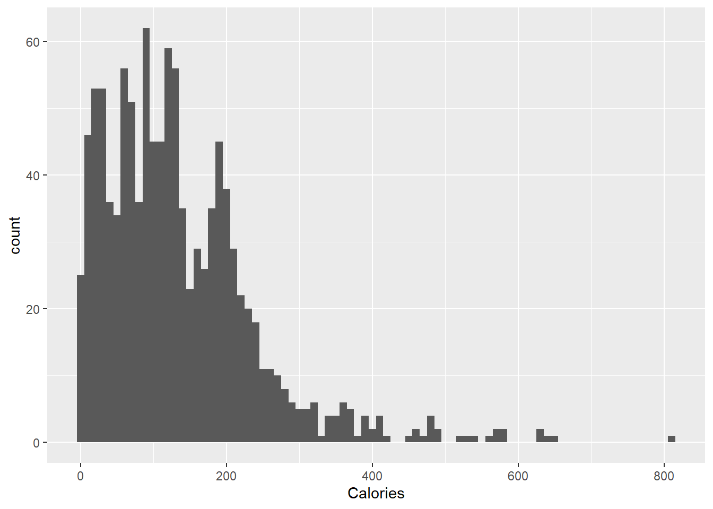
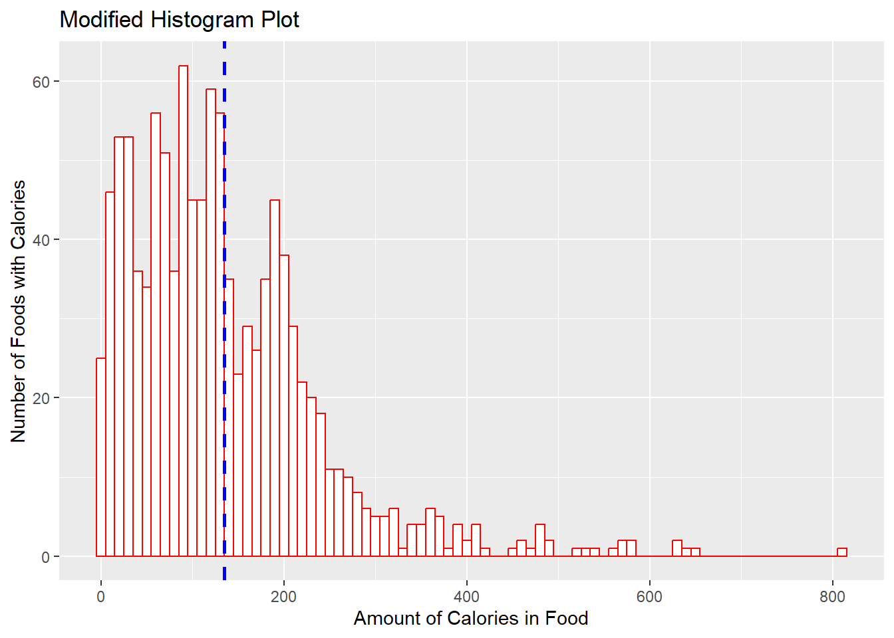
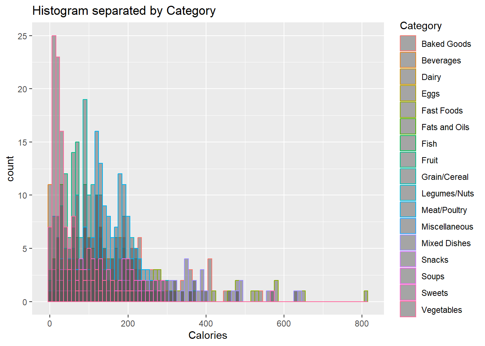

## Quarto and R Markdown

R Markdown is the traditional method for generating code and output into a document. Uses Knitr to combine code and text to create documents or presentations. For more on R Markdown see <https://rmarkdown.rstudio.com/>.

Like R Markdown Quartro uses Knitr to execute the R code and can even run R Markdown documents. Quarto enables you to weave together content and executable code into a finished document. To learn more about Quarto see <https://quarto.org>.

Both run on a similar framework. You have text interspersed with blocks of code (code blocks) that run to produce output that is inserted into the text (either tables, graphs, or raw text). For this example I will be using Quarto, to produce a word document (this file) and a HTML document (other file). This will be done to show how the same exact code does have some differences in the output, as well as to show the unique benefits and pros/cons of different output document types.

## Importing Data and Libraries

Just like when working in the R environment normally, you import libraries by calling them. Ideally this is done at the top of the document before any other code is run, but you can call the libraries anywhere in the code as long as it is **before** any functions requiring them.


::: {.cell}

:::


Data can be read in and saved to the enviroment (usually as either a table or Dataframe) just like in Base R as well. Below is a sample of reading in a simple dataset on Food info. It consists of 8 columns (category, item name, amount, calories, protein, fat, carbs, and fiber).

### Food Data


::: {.cell}
::: {.cell-output .cell-output-stdout}
```
# A tibble: 5 × 8
  Category    `Food Item`             Measure Calories Protein   Fat Carbs Fibre
  <chr>       <chr>                   <chr>      <dbl>   <dbl> <dbl> <dbl> <dbl>
1 Baked Goods Angelfood, commercial … 1/12          73       2    NA    16   0.4
2 Baked Goods Angelfood, from mix (2… 1/12         129       3    NA    29   0.1
3 Baked Goods Animal crackers (arrow… 2             45       1     1     7   0.2
4 Baked Goods Apple crisp, homemade   125mL        206       2     4    39   1.8
5 Baked Goods Apple, commercial, 2 c… 1/8          296       2    14    43   2  
```
:::
:::


### Death Rate Data


::: {.cell}
::: {.cell-output .cell-output-stdout}
```
                INDICATOR                                                 UNIT
1 Death rates for suicide Deaths per 100,000 resident population, age-adjusted
2 Death rates for suicide Deaths per 100,000 resident population, age-adjusted
3 Death rates for suicide Deaths per 100,000 resident population, age-adjusted
4 Death rates for suicide Deaths per 100,000 resident population, age-adjusted
5 Death rates for suicide Deaths per 100,000 resident population, age-adjusted
  UNIT_NUM STUB_NAME STUB_NAME_NUM  STUB_LABEL STUB_LABEL_NUM YEAR YEAR_NUM
1        1     Total             0 All persons              0 1950        1
2        1     Total             0 All persons              0 1960        2
3        1     Total             0 All persons              0 1970        3
4        1     Total             0 All persons              0 1980        4
5        1     Total             0 All persons              0 1981        5
       AGE AGE_NUM ESTIMATE FLAG
1 All ages       0     13.2 <NA>
2 All ages       0     12.5 <NA>
3 All ages       0     13.1 <NA>
4 All ages       0     12.2 <NA>
5 All ages       0     12.3 <NA>
```
:::
:::


R can read other formats of data too with other functions. Depending it may require a special package, or packages may exist to make it easier than the function built into base R.

## Making Tables

There are plenty of packages for producing tables. Especially summary tables, such as table1, gtsummary, or even by hand using Kable. For this example I will show a quick table in gtsummary.

### Gtsummary

gtsummary is another package capable of making tables. This includes functions like tbl_summary (shown below) for summary statistics, tbl_regression for regression tables, and more. Generally it is more robust than Table1, but can often take longer to load/render. For more on gtsummary click here <https://www.danieldsjoberg.com/gtsummary/>.


::: {.cell}
::: {.cell-output-display}

```{=html}
<div id="mxjqdmrnid" style="padding-left:0px;padding-right:0px;padding-top:10px;padding-bottom:10px;overflow-x:auto;overflow-y:auto;width:auto;height:auto;">
<style>#mxjqdmrnid table {
  font-family: system-ui, 'Segoe UI', Roboto, Helvetica, Arial, sans-serif, 'Apple Color Emoji', 'Segoe UI Emoji', 'Segoe UI Symbol', 'Noto Color Emoji';
  -webkit-font-smoothing: antialiased;
  -moz-osx-font-smoothing: grayscale;
}

#mxjqdmrnid thead, #mxjqdmrnid tbody, #mxjqdmrnid tfoot, #mxjqdmrnid tr, #mxjqdmrnid td, #mxjqdmrnid th {
  border-style: none;
}

#mxjqdmrnid p {
  margin: 0;
  padding: 0;
}

#mxjqdmrnid .gt_table {
  display: table;
  border-collapse: collapse;
  line-height: normal;
  margin-left: auto;
  margin-right: auto;
  color: #333333;
  font-size: 16px;
  font-weight: normal;
  font-style: normal;
  background-color: #FFFFFF;
  width: auto;
  border-top-style: solid;
  border-top-width: 2px;
  border-top-color: #A8A8A8;
  border-right-style: none;
  border-right-width: 2px;
  border-right-color: #D3D3D3;
  border-bottom-style: solid;
  border-bottom-width: 2px;
  border-bottom-color: #A8A8A8;
  border-left-style: none;
  border-left-width: 2px;
  border-left-color: #D3D3D3;
}

#mxjqdmrnid .gt_caption {
  padding-top: 4px;
  padding-bottom: 4px;
}

#mxjqdmrnid .gt_title {
  color: #333333;
  font-size: 125%;
  font-weight: initial;
  padding-top: 4px;
  padding-bottom: 4px;
  padding-left: 5px;
  padding-right: 5px;
  border-bottom-color: #FFFFFF;
  border-bottom-width: 0;
}

#mxjqdmrnid .gt_subtitle {
  color: #333333;
  font-size: 85%;
  font-weight: initial;
  padding-top: 3px;
  padding-bottom: 5px;
  padding-left: 5px;
  padding-right: 5px;
  border-top-color: #FFFFFF;
  border-top-width: 0;
}

#mxjqdmrnid .gt_heading {
  background-color: #FFFFFF;
  text-align: center;
  border-bottom-color: #FFFFFF;
  border-left-style: none;
  border-left-width: 1px;
  border-left-color: #D3D3D3;
  border-right-style: none;
  border-right-width: 1px;
  border-right-color: #D3D3D3;
}

#mxjqdmrnid .gt_bottom_border {
  border-bottom-style: solid;
  border-bottom-width: 2px;
  border-bottom-color: #D3D3D3;
}

#mxjqdmrnid .gt_col_headings {
  border-top-style: solid;
  border-top-width: 2px;
  border-top-color: #D3D3D3;
  border-bottom-style: solid;
  border-bottom-width: 2px;
  border-bottom-color: #D3D3D3;
  border-left-style: none;
  border-left-width: 1px;
  border-left-color: #D3D3D3;
  border-right-style: none;
  border-right-width: 1px;
  border-right-color: #D3D3D3;
}

#mxjqdmrnid .gt_col_heading {
  color: #333333;
  background-color: #FFFFFF;
  font-size: 100%;
  font-weight: normal;
  text-transform: inherit;
  border-left-style: none;
  border-left-width: 1px;
  border-left-color: #D3D3D3;
  border-right-style: none;
  border-right-width: 1px;
  border-right-color: #D3D3D3;
  vertical-align: bottom;
  padding-top: 5px;
  padding-bottom: 6px;
  padding-left: 5px;
  padding-right: 5px;
  overflow-x: hidden;
}

#mxjqdmrnid .gt_column_spanner_outer {
  color: #333333;
  background-color: #FFFFFF;
  font-size: 100%;
  font-weight: normal;
  text-transform: inherit;
  padding-top: 0;
  padding-bottom: 0;
  padding-left: 4px;
  padding-right: 4px;
}

#mxjqdmrnid .gt_column_spanner_outer:first-child {
  padding-left: 0;
}

#mxjqdmrnid .gt_column_spanner_outer:last-child {
  padding-right: 0;
}

#mxjqdmrnid .gt_column_spanner {
  border-bottom-style: solid;
  border-bottom-width: 2px;
  border-bottom-color: #D3D3D3;
  vertical-align: bottom;
  padding-top: 5px;
  padding-bottom: 5px;
  overflow-x: hidden;
  display: inline-block;
  width: 100%;
}

#mxjqdmrnid .gt_spanner_row {
  border-bottom-style: hidden;
}

#mxjqdmrnid .gt_group_heading {
  padding-top: 8px;
  padding-bottom: 8px;
  padding-left: 5px;
  padding-right: 5px;
  color: #333333;
  background-color: #FFFFFF;
  font-size: 100%;
  font-weight: initial;
  text-transform: inherit;
  border-top-style: solid;
  border-top-width: 2px;
  border-top-color: #D3D3D3;
  border-bottom-style: solid;
  border-bottom-width: 2px;
  border-bottom-color: #D3D3D3;
  border-left-style: none;
  border-left-width: 1px;
  border-left-color: #D3D3D3;
  border-right-style: none;
  border-right-width: 1px;
  border-right-color: #D3D3D3;
  vertical-align: middle;
  text-align: left;
}

#mxjqdmrnid .gt_empty_group_heading {
  padding: 0.5px;
  color: #333333;
  background-color: #FFFFFF;
  font-size: 100%;
  font-weight: initial;
  border-top-style: solid;
  border-top-width: 2px;
  border-top-color: #D3D3D3;
  border-bottom-style: solid;
  border-bottom-width: 2px;
  border-bottom-color: #D3D3D3;
  vertical-align: middle;
}

#mxjqdmrnid .gt_from_md > :first-child {
  margin-top: 0;
}

#mxjqdmrnid .gt_from_md > :last-child {
  margin-bottom: 0;
}

#mxjqdmrnid .gt_row {
  padding-top: 8px;
  padding-bottom: 8px;
  padding-left: 5px;
  padding-right: 5px;
  margin: 10px;
  border-top-style: solid;
  border-top-width: 1px;
  border-top-color: #D3D3D3;
  border-left-style: none;
  border-left-width: 1px;
  border-left-color: #D3D3D3;
  border-right-style: none;
  border-right-width: 1px;
  border-right-color: #D3D3D3;
  vertical-align: middle;
  overflow-x: hidden;
}

#mxjqdmrnid .gt_stub {
  color: #333333;
  background-color: #FFFFFF;
  font-size: 100%;
  font-weight: initial;
  text-transform: inherit;
  border-right-style: solid;
  border-right-width: 2px;
  border-right-color: #D3D3D3;
  padding-left: 5px;
  padding-right: 5px;
}

#mxjqdmrnid .gt_stub_row_group {
  color: #333333;
  background-color: #FFFFFF;
  font-size: 100%;
  font-weight: initial;
  text-transform: inherit;
  border-right-style: solid;
  border-right-width: 2px;
  border-right-color: #D3D3D3;
  padding-left: 5px;
  padding-right: 5px;
  vertical-align: top;
}

#mxjqdmrnid .gt_row_group_first td {
  border-top-width: 2px;
}

#mxjqdmrnid .gt_row_group_first th {
  border-top-width: 2px;
}

#mxjqdmrnid .gt_summary_row {
  color: #333333;
  background-color: #FFFFFF;
  text-transform: inherit;
  padding-top: 8px;
  padding-bottom: 8px;
  padding-left: 5px;
  padding-right: 5px;
}

#mxjqdmrnid .gt_first_summary_row {
  border-top-style: solid;
  border-top-color: #D3D3D3;
}

#mxjqdmrnid .gt_first_summary_row.thick {
  border-top-width: 2px;
}

#mxjqdmrnid .gt_last_summary_row {
  padding-top: 8px;
  padding-bottom: 8px;
  padding-left: 5px;
  padding-right: 5px;
  border-bottom-style: solid;
  border-bottom-width: 2px;
  border-bottom-color: #D3D3D3;
}

#mxjqdmrnid .gt_grand_summary_row {
  color: #333333;
  background-color: #FFFFFF;
  text-transform: inherit;
  padding-top: 8px;
  padding-bottom: 8px;
  padding-left: 5px;
  padding-right: 5px;
}

#mxjqdmrnid .gt_first_grand_summary_row {
  padding-top: 8px;
  padding-bottom: 8px;
  padding-left: 5px;
  padding-right: 5px;
  border-top-style: double;
  border-top-width: 6px;
  border-top-color: #D3D3D3;
}

#mxjqdmrnid .gt_last_grand_summary_row_top {
  padding-top: 8px;
  padding-bottom: 8px;
  padding-left: 5px;
  padding-right: 5px;
  border-bottom-style: double;
  border-bottom-width: 6px;
  border-bottom-color: #D3D3D3;
}

#mxjqdmrnid .gt_striped {
  background-color: rgba(128, 128, 128, 0.05);
}

#mxjqdmrnid .gt_table_body {
  border-top-style: solid;
  border-top-width: 2px;
  border-top-color: #D3D3D3;
  border-bottom-style: solid;
  border-bottom-width: 2px;
  border-bottom-color: #D3D3D3;
}

#mxjqdmrnid .gt_footnotes {
  color: #333333;
  background-color: #FFFFFF;
  border-bottom-style: none;
  border-bottom-width: 2px;
  border-bottom-color: #D3D3D3;
  border-left-style: none;
  border-left-width: 2px;
  border-left-color: #D3D3D3;
  border-right-style: none;
  border-right-width: 2px;
  border-right-color: #D3D3D3;
}

#mxjqdmrnid .gt_footnote {
  margin: 0px;
  font-size: 90%;
  padding-top: 4px;
  padding-bottom: 4px;
  padding-left: 5px;
  padding-right: 5px;
}

#mxjqdmrnid .gt_sourcenotes {
  color: #333333;
  background-color: #FFFFFF;
  border-bottom-style: none;
  border-bottom-width: 2px;
  border-bottom-color: #D3D3D3;
  border-left-style: none;
  border-left-width: 2px;
  border-left-color: #D3D3D3;
  border-right-style: none;
  border-right-width: 2px;
  border-right-color: #D3D3D3;
}

#mxjqdmrnid .gt_sourcenote {
  font-size: 90%;
  padding-top: 4px;
  padding-bottom: 4px;
  padding-left: 5px;
  padding-right: 5px;
}

#mxjqdmrnid .gt_left {
  text-align: left;
}

#mxjqdmrnid .gt_center {
  text-align: center;
}

#mxjqdmrnid .gt_right {
  text-align: right;
  font-variant-numeric: tabular-nums;
}

#mxjqdmrnid .gt_font_normal {
  font-weight: normal;
}

#mxjqdmrnid .gt_font_bold {
  font-weight: bold;
}

#mxjqdmrnid .gt_font_italic {
  font-style: italic;
}

#mxjqdmrnid .gt_super {
  font-size: 65%;
}

#mxjqdmrnid .gt_footnote_marks {
  font-size: 75%;
  vertical-align: 0.4em;
  position: initial;
}

#mxjqdmrnid .gt_asterisk {
  font-size: 100%;
  vertical-align: 0;
}

#mxjqdmrnid .gt_indent_1 {
  text-indent: 5px;
}

#mxjqdmrnid .gt_indent_2 {
  text-indent: 10px;
}

#mxjqdmrnid .gt_indent_3 {
  text-indent: 15px;
}

#mxjqdmrnid .gt_indent_4 {
  text-indent: 20px;
}

#mxjqdmrnid .gt_indent_5 {
  text-indent: 25px;
}
</style>
<table class="gt_table" data-quarto-disable-processing="false" data-quarto-bootstrap="false">
  <thead>
    
    <tr class="gt_col_headings">
      <th class="gt_col_heading gt_columns_bottom_border gt_left" rowspan="1" colspan="1" scope="col" id="&lt;strong&gt;Characteristic&lt;/strong&gt;"><strong>Characteristic</strong></th>
      <th class="gt_col_heading gt_columns_bottom_border gt_center" rowspan="1" colspan="1" scope="col" id="&lt;strong&gt;Drug A&lt;/strong&gt;, N = 98&lt;span class=&quot;gt_footnote_marks&quot; style=&quot;white-space:nowrap;font-style:italic;font-weight:normal;&quot;&gt;&lt;sup&gt;1&lt;/sup&gt;&lt;/span&gt;"><strong>Drug A</strong>, N = 98<span class="gt_footnote_marks" style="white-space:nowrap;font-style:italic;font-weight:normal;"><sup>1</sup></span></th>
      <th class="gt_col_heading gt_columns_bottom_border gt_center" rowspan="1" colspan="1" scope="col" id="&lt;strong&gt;Drug B&lt;/strong&gt;, N = 102&lt;span class=&quot;gt_footnote_marks&quot; style=&quot;white-space:nowrap;font-style:italic;font-weight:normal;&quot;&gt;&lt;sup&gt;1&lt;/sup&gt;&lt;/span&gt;"><strong>Drug B</strong>, N = 102<span class="gt_footnote_marks" style="white-space:nowrap;font-style:italic;font-weight:normal;"><sup>1</sup></span></th>
    </tr>
  </thead>
  <tbody class="gt_table_body">
    <tr><td headers="label" class="gt_row gt_left">Age</td>
<td headers="stat_1" class="gt_row gt_center">46 (37, 59)</td>
<td headers="stat_2" class="gt_row gt_center">48 (39, 56)</td></tr>
    <tr><td headers="label" class="gt_row gt_left">    Unknown</td>
<td headers="stat_1" class="gt_row gt_center">7</td>
<td headers="stat_2" class="gt_row gt_center">4</td></tr>
    <tr><td headers="label" class="gt_row gt_left">Marker Level (ng/mL)</td>
<td headers="stat_1" class="gt_row gt_center">0.84 (0.24, 1.57)</td>
<td headers="stat_2" class="gt_row gt_center">0.52 (0.19, 1.20)</td></tr>
    <tr><td headers="label" class="gt_row gt_left">    Unknown</td>
<td headers="stat_1" class="gt_row gt_center">6</td>
<td headers="stat_2" class="gt_row gt_center">4</td></tr>
    <tr><td headers="label" class="gt_row gt_left">T Stage</td>
<td headers="stat_1" class="gt_row gt_center"></td>
<td headers="stat_2" class="gt_row gt_center"></td></tr>
    <tr><td headers="label" class="gt_row gt_left">    T1</td>
<td headers="stat_1" class="gt_row gt_center">28 (29%)</td>
<td headers="stat_2" class="gt_row gt_center">25 (25%)</td></tr>
    <tr><td headers="label" class="gt_row gt_left">    T2</td>
<td headers="stat_1" class="gt_row gt_center">25 (26%)</td>
<td headers="stat_2" class="gt_row gt_center">29 (28%)</td></tr>
    <tr><td headers="label" class="gt_row gt_left">    T3</td>
<td headers="stat_1" class="gt_row gt_center">22 (22%)</td>
<td headers="stat_2" class="gt_row gt_center">21 (21%)</td></tr>
    <tr><td headers="label" class="gt_row gt_left">    T4</td>
<td headers="stat_1" class="gt_row gt_center">23 (23%)</td>
<td headers="stat_2" class="gt_row gt_center">27 (26%)</td></tr>
    <tr><td headers="label" class="gt_row gt_left">Grade</td>
<td headers="stat_1" class="gt_row gt_center"></td>
<td headers="stat_2" class="gt_row gt_center"></td></tr>
    <tr><td headers="label" class="gt_row gt_left">    I</td>
<td headers="stat_1" class="gt_row gt_center">35 (36%)</td>
<td headers="stat_2" class="gt_row gt_center">33 (32%)</td></tr>
    <tr><td headers="label" class="gt_row gt_left">    II</td>
<td headers="stat_1" class="gt_row gt_center">32 (33%)</td>
<td headers="stat_2" class="gt_row gt_center">36 (35%)</td></tr>
    <tr><td headers="label" class="gt_row gt_left">    III</td>
<td headers="stat_1" class="gt_row gt_center">31 (32%)</td>
<td headers="stat_2" class="gt_row gt_center">33 (32%)</td></tr>
    <tr><td headers="label" class="gt_row gt_left">Patient Died</td>
<td headers="stat_1" class="gt_row gt_center">52 (53%)</td>
<td headers="stat_2" class="gt_row gt_center">60 (59%)</td></tr>
  </tbody>
  
  <tfoot class="gt_footnotes">
    <tr>
      <td class="gt_footnote" colspan="3"><span class="gt_footnote_marks" style="white-space:nowrap;font-style:italic;font-weight:normal;"><sup>1</sup></span> Median (IQR); n (%)</td>
    </tr>
  </tfoot>
</table>
</div>
```

:::
:::


## Making Figures

By far the best package used for making figures is ggplot2, however depending on the type of figure you need or want to make other packages exist. Much like how code blocks are used to generate tables, code blocks are also used to create figures.


::: {.cell}
::: {.cell-output-display}
{width=672}
:::
:::


ggplot allows you to completely modify graphs, such as changing color, appearance, labels, titles, and more.


::: {.cell}
::: {.cell-output-display}
{width=672}
:::

::: {.cell-output-display}
{width=672}
:::
:::


## Hiding Code and Code Output

Sometimes (or most of the time) you don't want the client to see the raw code. Either cause it doesn't look good, or because it's not important. You can do this simply by adding `#| echo: false` to the top of the command arguments. For example: here is how the code would look:


::: {.cell}

```{.r .cell-code}
# #| echo: false

print("hello world")
```
:::


and here is just the output of that code, with no visible code:


::: {.cell}
::: {.cell-output .cell-output-stdout}
```
[1] "hello world"
```
:::
:::


You can also suppress warnings, messages, or even the output with other commands such as:

`#| warning: false` \<\-- suppresses warnings in the output

`#| eval: false` \<\-- just echos the code, but does not run the code (this can be done if you want to show code, but not actually run it)

`#| output: false`\<\--don't include the results of executing the code in the output

`#| error: false` \<\-- suppresses errors in output (implies that errors executing code will not halt processing/rendering of document)

`#| include: false` \<\-- prevents any output (code or results) from being included in output

These and more execution options can be found here <https://quarto.org/docs/computations/execution-options.html>.
